# 近两年顶会 AI Agents 研究：Multi-Agent 与 GUI Agent 进展综述

## 执行摘要

过去两年（以 2024–2025 年的 NeurIPS/ICML/ICLR/CVPR 为主），“AI Agents”研究的重心出现了两个清晰的收敛方向：其一是 **LLM 驱动的多智能体（Multi-Agent）协作**，从“静态编排/手工角色分工”走向“可学习、可自适应的协作策略与安全防护”；其二是 **GUI Agent（面向网页/桌面/移动端界面）**，从“HTML/DOM 纯文本”与“整屏视觉”两条路线，逐步融合为“结构化 UI 表征 + 端到端视觉 grounding + 可泛化数据/基准”的体系化路线。citeturn43search1turn46view0turn40search0turn55view1turn25search6

在 Multi-Agent 方向，代表性进展包括：  
一是 **协作机制的“可学习化”**：例如 COPPER 用“共享反思器 + 反事实信用分配（counterfactual PPO）”提升多智能体反思质量与训练稳定性，并在问答、数学与博弈基准上带来显著增益。citeturn44search8turn43search1 二是 **“中心化编排器/路由器”范式**：如 Evolving Orchestration（puppeteer）将“调用哪个 agent、何时终止、如何裁剪冗余”建模为序列决策并用强化学习优化，在 GSM-Hard、MMLU-Pro 等任务上形成“性能—成本”更优的协作结构。citeturn46view0turn47view1turn45search8 三是 **失败机理与安全治理的“工具化”**：Why do multi-agent LLM systems fail? 提出经实证扎根的失败分类体系 MAST，并配套 LLM-as-a-Judge 与开放数据集；GUARDIAN 则把多轮协作过程刻画为时序属性图，在“幻觉放大/错误注入与传播”情景下，以准确率与 API 调用量为核心指标给出系统化防护方案。citeturn56view0turn52view0turn53view3

在 GUI Agent 方向，CVPR/ICLR 的主线正在从“能看懂界面”走向“能稳定执行长程交互”。CogAgent 将高分辨率 GUI 视觉理解作为基础能力，以仅截图输入在网页与 Android 导航任务（Mind2Web、AITW）上击败依赖 HTML 的方法，并在多类 VQA/文档理解上达到 SOTA；Dual-View Visual Contextualization（Dual-VCR）则证明“只取截图里与目标元素相邻的局部上下文”比“整屏/整 HTML”更高效，带来跨任务/跨站点/跨域多指标一致提升；GUI-Xplore 与 SpiritSight 进一步把“可泛化数据与评测”推进到移动 App 层面：前者用“探索视频 + 图结构推理”降低泛化瓶颈，后者以大规模 GUI 数据与 Universal Block Parsing 强化视觉 grounding，并在多个 GUI 基准上取得优势。citeturn40search9turn55view1turn25search6turn40search13turn25search15

需要强调的是：在顶会论文谱系里，**许多来自工业实验室（如 OpenAI、DeepMind 等）**的 agent 系统更常以技术报告、产品/系统论文或其他 venue 出现；在本报告聚焦的“顶会主会/Workshop+OpenReview/官方开源论文”范围内，大学与开源团队仍贡献了大量可复现的关键基准与方法模块。citeturn31search2turn21search5turn40search6

## 范围与方法

本文覆盖时间窗口为 **2024-03-25 至 2026-03-25**（以论文发表/会议年份为准），重点筛选 **2024–2025 年**的：  
**NeurIPS（Advances in Neural Information Processing Systems）**、**ICML（International Conference on Machine Learning）**、**ICLR（International Conference on Learning Representations）**、**CVPR（IEEE/CVF Conference on Computer Vision and Pattern Recognition）**相关工作，并优先引用：会议官方页面/Proceedings、entity["organization","OpenReview","peer review platform"]、entity["organization","arXiv","preprint server"]、entity["company","GitHub","code hosting platform"]、entity["organization","Computer Vision Foundation","cvf open access"] 等一手来源。citeturn21search18turn21search5turn21search13turn40search18turn43search1

“影响力”采用多信号：  
一是（可获得时）来自 Semantic Scholar/OpenReview/Proceedings 索引的引用量（**截至 2026-03-25**，不同数据库口径可能不一致，表格中会注明来源）；二是研究主题的“基础设施属性”（如基准、数据集、评测协议）；三是是否提供代码/数据与是否可复现。citeturn35view0turn36search15turn36search6turn40search0turn19search0

由于“AI Agents”跨越系统、NLP、CV、RL、HCI 等多个子领域，本报告对 Multi-Agent 与 GUI Agent 的边界做了操作性定义：  
Multi-Agent 指至少两个 LLM/策略实体在任务求解中产生显式信息交互（协商、辩论、分工、编排、互评/反思、路由、投票等）；GUI Agent 指以真实或准真实 GUI（网页/移动/桌面）为环境，进行元素定位（grounding）、动作预测（点击/输入/拖拽等）与多步导航。citeturn56view0turn54view0turn40search9turn25search6turn40search13

## 论文清单与索引表

下表给出“强相关论文”索引（含本报告后文深度解读的 12 篇 + 若干高影响扩展阅读）。引用量若可获得，均以对应来源页面显示为准（括号注明来源）。  

> 注：链接按要求提供为主（arXiv/Proceedings/OpenAccess/OpenReview/代码库）；建议优先从会议/论文主页获取最终版本与补充材料。citeturn43search1turn40search6turn21search13

| 方向 | 论文（重点） | 作者/机构（从论文页可见信息摘录） | 会议/年份 | 引用量（如可得） | 论文链接 | 代码/资源 |
|---|---|---|---|---:|---|---|
| Multi-Agent | COPPER: *Reflective Multi-Agent Collaboration based on Large Language Models* | Xiaohe Bo 等（NeurIPS 论文页） | NeurIPS 2024 | 109（Proceedings/OpenReview 索引）citeturn43search1turn44search8turn44search15 | `https://proceedings.neurips.cc/paper_files/paper/2024/hash/fa54b0edce5eef0bb07654e8ee800cb4-Abstract-Conference.html` citeturn43search1 | （以论文页/补充材料为准） |
| Multi-Agent（软件） | MAGIS: *LLM-Based Multi-Agent Framework for GitHub Issue ReSolution* | 复旦大学/澳门大学/莱斯大学（arXiv HTML）citeturn42view0 | NeurIPS 2024 | 159（Proceedings 索引）citeturn39search13 | `https://arxiv.org/abs/2403.17927` citeturn41search0 | `https://github.com/co-evolve-lab/magis` citeturn41search9 |
| Multi-Agent（金融） | FinCon: *Conceptual Verbal Reinforcement…* | （以 arXiv 为主） | NeurIPS 2024 | 251（arXiv 索引）citeturn36search6 | `https://arxiv.org/abs/2407.06567` citeturn36search6 | （以论文/附录为准） |
| Multi-Agent（集成/路由） | *Mixture-of-Agents Enhances Large Language Model Capabilities* | Duke / Together AI / UChicago / Stanford（ICLR PDF）citeturn13view0 | ICLR 2025 | 315（Semantic Scholar）/ 348（OpenReview PDF 索引）citeturn36search3turn36search15 | `https://openreview.net/pdf?id=h0ZfDIrj7T` citeturn36search15 | `https://github.com/togethercomputer/moa` citeturn13view0 |
| Multi-Agent（环境中协作） | *Hypothetical Minds: Scaffolding Theory of Mind…* | Stanford（ICLR PDF）citeturn51view0 | ICLR 2025 | 46（OpenReview PDF 索引）citeturn24search0 | `https://proceedings.iclr.cc/paper_files/paper/2025/file/12f483f624b378f9f3058d8ecd3c7ff5-Paper-Conference.pdf` citeturn51view0 | （以论文附录 prompt/代码为准） |
| Multi-Agent（失效机理） | *Why do multi-agent LLM systems fail?*（MAST） | entity["organization","University of California, Berkeley","berkeley, ca, us"] 等（PDF）citeturn56view0 | ICLR 2025 Workshop | 67（OpenReview PDF 索引）citeturn19search0 | `https://openreview.net/pdf?id=wM521FqPvI` citeturn56view0 | `https://github.com/multi-agent-systems-failure-taxonomy/MAST` citeturn56view0 |
| Multi-Agent（可学习编排） | *Multi-Agent Collaboration via Evolving Orchestration* | 清华/上交/北邮/西门子/腾讯 Robotics X（arXiv HTML）citeturn46view0 | NeurIPS 2025 | 41（Semantic Scholar）citeturn45search8 | `https://arxiv.org/abs/2505.19591` citeturn45search0 | `https://github.com/OpenBMB/ChatDev/tree/puppeteer` citeturn46view0 |
| Multi-Agent（安全） | *GUARDIAN: Safeguarding LLM Multi-Agent Collaborations…* | entity["organization","King’s College London","london, uk"] / 北京理工 / 清华（arXiv HTML）citeturn52view0 | NeurIPS 2025 | 12–16（OpenReview/索引口径）citeturn34search0turn34search1 | `https://arxiv.org/abs/2505.19234` citeturn48search0 | `https://github.com/JialongZhou666/GUARDIAN` citeturn52view0 |
| GUI Agent（VLM） | CogAgent: *A Visual Language Model for GUI Agents* | （CVPR OpenAccess）citeturn40search0turn40search9 | CVPR 2024 | 665（Semantic Scholar 页面）citeturn35view0 | `https://openaccess.thecvf.com/content/CVPR2024/html/Hong_CogAgent_A_Visual_Language_Model_for_GUI_Agents_CVPR_2024_paper.html` citeturn40search0 | `https://github.com/THUDM/CogVLM`（论文页提及）citeturn40search9 |
| GUI Agent（网页导航） | *Dual-View Visual Contextualization for Web Navigation*（Dual‑VCR） | OSU 等（arXiv HTML）citeturn54view0 | CVPR 2024 | 29–30（OpenAccess 索引）citeturn25search0turn40search1 | `https://arxiv.org/html/2402.04476v2` citeturn54view0 | （以论文页/补充材料为准） |
| GUI Agent（数据+泛化） | GUI‑Xplore: *Empowering Generalizable GUI Agents with One Exploration* | （CVPR OpenAccess）citeturn25search6turn25search7turn25search10 | CVPR 2025 | 18（OpenAccess 索引）citeturn25search6 | `https://openaccess.thecvf.com/content/CVPR2025/html/Sun_GUI-Xplore_Empowering_Generalizable_GUI_Agents_with_One_Exploration_CVPR_2025_paper.html` citeturn25search6 | （补充材料含数据细节）citeturn25search10 |
| GUI Agent（端到端+grounding） | SpiritSight Agent: *Advanced GUI Agent with One Look* | （CVPR OpenAccess + arXiv）citeturn40search13turn25search15 | CVPR 2025 | 16（OpenAccess/索引）citeturn25search5turn40search2 | `https://arxiv.org/abs/2503.03196` citeturn40search13 | 项目页/模型数据链接见论文citeturn40search13 |
| 扩展（高影响，强相关） | MetaGPT: *Meta Programming for Multi-Agent Collaborative Framework* | （高被引，ICLR 2024）citeturn38search2 | ICLR 2024 | 1489（Semantic Scholar 页面）citeturn38search2 | （建议从 ICLR/OpenReview 获取最终版）citeturn21search13 | — |
| 扩展（GUI 数据/综述） | Mind2Web（Web Agent 数据集主页） | entity["organization","Ohio State University","columbus, oh, us"] NLP 组（主页）citeturn25search3 | — | — | `https://osu-nlp-group.github.io/Mind2Web/` citeturn25search3 | 主页含 code/data 指引citeturn25search3 |
| 扩展（评测基准） | SWE‑bench 引用与官方条目 | （官方站点）citeturn39search5 | ICLR 2024 Oral | — | `https://www.swebench.com/citations.html` citeturn39search5 | — |
| 中文索引（辅助检索） | CVPR 2024 Papers（中文整理） | 52CV GitHub（索引）citeturn25search18 | — | — | `https://github.com/52CV/CVPR-2024-Papers` citeturn25search18 | — |

## 必读论文深度解读

本节对 12 篇“必读”论文做结构化解读。每篇均给出：问题定义、技术贡献、结构图、数据/实验设置、核心结果、优缺点与复现要点；引用均来自论文/会议/代码一手来源。citeturn43search1turn42view0turn8view0turn36search15turn51view0turn56view0turn46view0turn52view0turn40search0turn55view1turn25search6turn40search13

**COPPER（NeurIPS 2024）— 让“反思”在多智能体里可训练、可归因**citeturn43search1turn44search8  
问题：多智能体的自反思（self-reflection）能提升性能，但往往依赖手工 prompt、反思质量不稳定，且多 agent 情况下存在难以分配的信用归因问题（credit assignment）。citeturn43search1turn44search8  
贡献：提出 COPPER，把“反思器（reflector）”做成可微调的共享模块，并用 **counterfactual PPO** 估计单个反思对总体收益的边际贡献，从而提升训练稳定性与反思质量。citeturn43search1turn44search8  
结构（简化流程图）：
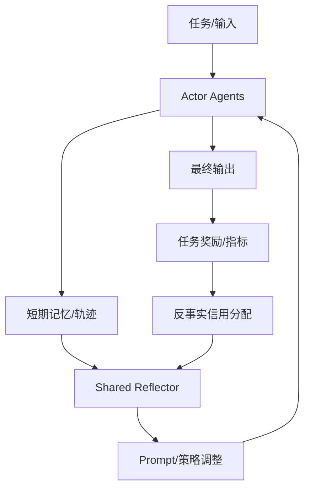
数据与设置：论文在 HotPotQA、GSM8K、Checkmate 等任务上评估，并比较不同训练与反思策略。citeturn44search8  
主要结果：相对基线提升显著——论文报告在 HotPotQA、GSM8K 与 Checkmate 上分别带来 **31.8% / 18.5% / 86.4%** 的提升（以论文表述为准）。citeturn3view0turn44search8  
优点/局限：优点在于把“反思”从 prompt 技巧升级为可训练组件，并引入“反事实”缓解归因；局限是仍依赖外部奖励/评测定义，且反思器训练成本与数据构造方式会影响泛化。citeturn43search1turn44search15  
复现要点：需关注反思器训练数据来源、counterfactual reward 的构造与与任务指标的一致性；建议从 NeurIPS proceedings 与 OpenReview 版本同步查看补充材料与实现细节。citeturn43search1turn44search8turn44search15

**MAGIS（NeurIPS 2024）— 面向真实仓库的 GitHub Issue 修复多智能体流程**citeturn42view0turn41search9  
问题：仓库级软件演化（issue 修复）需要长上下文、文件检索、跨文件修改与测试验证，单一 LLM 难以稳定完成。citeturn42view0turn39search13  
贡献：提出四类角色（Manager / Repository Custodian / Developer / QA Engineer）组织“规划—定位—编码—验证”的协作流程，并分析影响修复率的重要因素（如 line location 能力）。citeturn42view0turn39search13  
结构图：
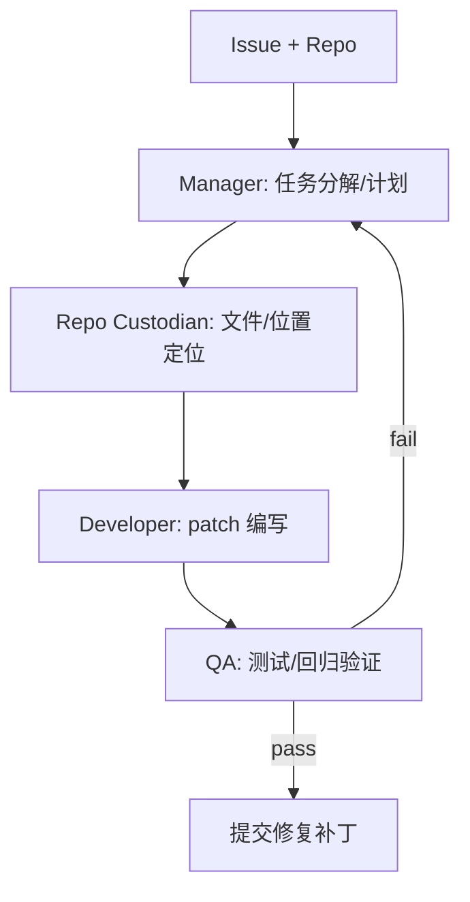
数据与实验：使用 SWE-bench（含 w/ Oracle 与 w/o Oracle 设置）作为评测基准，并以“applied ratio/resolved ratio”等指标衡量是否能应用补丁并通过测试。citeturn42view0turn39search5  
主要结果：在 SWE-bench 上，MAGIS 报告 **resolved ratio 13.94%**，并称相对直接使用 GPT-4 取得约 **8 倍**提升。citeturn42view0turn39search13 同时论文还给出与 Devin 的对比：在其设置下，MAGIS 仅使用 shell 工具，报告每个成功 issue 可在约 3 分钟内完成、平均每实例 <5 分钟。citeturn42view0  
优点/局限：优点是把“软件工程 agent”拆成可审计的子过程并在真实基准上量化；局限在数据覆盖（SWE-bench 以 Python 仓库为主）与外部工具/检索能力的依赖。citeturn42view0turn39search5  
复现要点：官方代码仓库提供运行与 SWE-bench 复现实验说明；复现时需严格对齐 SWE-bench 的版本、评测脚本与环境（依赖与测试）。citeturn41search9turn39search5

**FinCon（NeurIPS 2024）— 用“概念化语言反馈”强化金融多智能体决策**citeturn8view0turn36search6  
问题：金融任务（交易/组合/问答/研究）常需多源信息综合与时序决策；多智能体系统虽可分工，但“经验如何沉淀并及时修正”不足。citeturn8view0turn36search6  
贡献：提出 FinCon，将多智能体交互的经验提炼为 **conceptual verbal reinforcement（概念化语言强化）**，用于跨任务的经验再利用与自我修正。citeturn8view0turn36search6  
结构图（概念化）：
```mermaid
flowchart TD
  Q[金融任务输入] --> MAS[多智能体: 研究/摘要/推理/决策]
  MAS --> A[行动/答案/交易]
  A --> FB[结果反馈(收益/准确率/约束)]
  FB --> CVR[Conceptual Verbal Reinforcement]
  CVR --> MEM[经验库/概念规则]
  MEM --> MAS
```
数据与实验：论文在“单资产交易、组合管理”等金融决策任务上评估，并通过累计收益、夏普比率等衡量策略质量。citeturn8view0turn9view0  
主要结果：论文在组合管理实验中报告 FinCon 的绩效显著优于对比方法；其表格结果显示 FinCon 在该设置下的累计收益与夏普比率数值领先（例如表中给出 cumulative return 与 Sharpe ratio 的对比）。citeturn9view0turn8view0  
优点/局限：优点在于把“反馈”从数值奖励扩展到可复用的语言概念层；局限是金融回测极易受数据切分、交易成本、滑点、未来函数等细节影响，跨市场泛化需更严格协议。citeturn8view0turn9view0  
复现要点：优先核对论文是否公开完整数据、交易规则与评测脚本；若只给出部分数据区间（如 2013–2024 的资产池），需要补全数据源、费用模型与随机种子对齐。citeturn8view0turn9view0

**Mixture-of-Agents（ICLR 2025）— 用分层“多模型集成”逼近更强 LLM 的能力**citeturn36search15turn13view0  
问题：LLM 种类与能力谱系日益丰富，如何“以更低成本”组合多个模型/agent 的输出，获得更强表现。citeturn36search7turn13view0  
贡献：提出分层 MoA：每一层由多个 LLM agent 组成，上层 agent 以“下层所有输出”为辅助信息再生成；强调无需训练或用极少训练即可获得强集成增益。citeturn36search7turn13view0  
结构图：
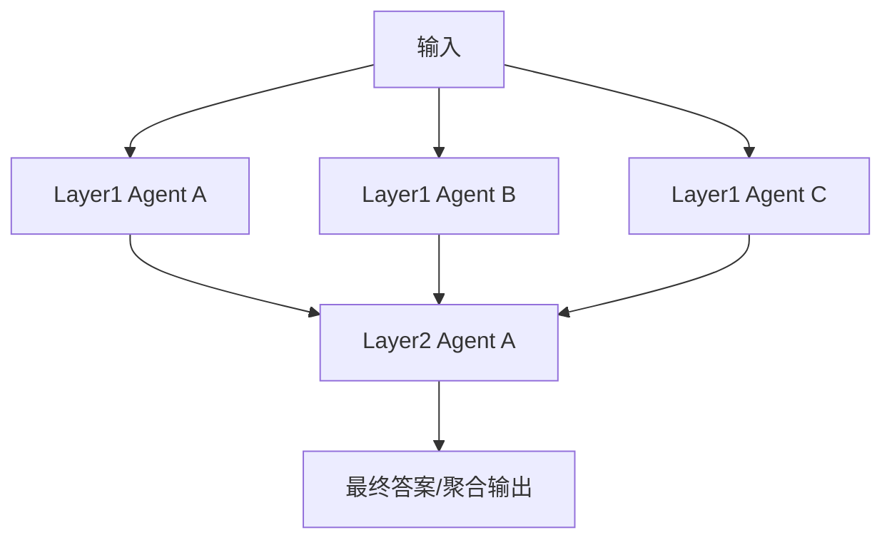
数据与实验：在 AlpacaEval 2.0、MT-Bench、FLASK 等评测上给出对比，并区分“仅开源模型组成的 MoA”等设置。citeturn36search7turn13view0  
主要结果：论文给出一个标志性数字：仅用开源模型组成的 MoA 在 AlpacaEval 2.0 上达 **65.1%**，对比 GPT‑4 Omni 的 **57.5%**（以论文摘要/结果描述为准）。citeturn36search7turn36search15  
优点/局限：优点是简单、工程落地快、可与“路由/成本约束”结合；局限是多轮调用成本与延迟上升，且对任务分布与投票/聚合策略敏感。citeturn36search7turn13view0  
复现要点：代码仓库公开；复现时要严格对齐基准版本（尤其是对话式评测的提示模板与评审器协议）。citeturn13view0turn36search15

**Hypothetical Minds（ICLR 2025）— 在多智能体环境里用“ToM 假设—验证”提升适应**citeturn51view0turn23view0  
问题：传统 MARL 在多智能体非平稳性下泛化困难，而 LLM agent 往往缺少对他者策略的显式建模，导致在线适应弱。citeturn23view0turn51view0  
贡献：提出 Hypothetical Minds：包含感知、记忆、两层层级规划；核心 ToM 模块生成多种关于他者策略的自然语言假设，并通过交互获得的（含反事实）反馈迭代验证与强化假设。citeturn23view0turn51view0  
结构图：
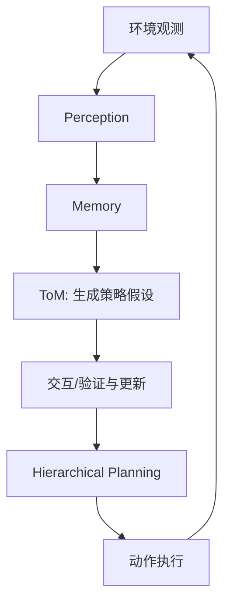
数据与实验：在 Melting Pot 多智能体环境的多个场景中评估，并将 HM 与 Reflexion、ReAct、PlanReAct 等基线对比。citeturn51view0turn23view0  
主要结果：论文在“Running With Scissors Repeated”等评测场景给出每种对手策略配置下的回报均值±方差；例如在 SC0（混合对手）下 HM（ours）显著高于多种基线。citeturn51view0 论文还给出单 episode 成本估计（如 HM‑GPT4、ReAct 等的金钱成本与时间消耗对比）。citeturn51view0  
优点/局限：优点在于把“对他者建模”显式化并做成可迭代验证过程；局限是成本偏高、对提示与“假设空间/top‑k”等超参数敏感，且环境可观测性与对手策略空间会影响可迁移性。citeturn51view0  
复现要点：论文附录包含大量 prompt 与超参数/成本配置；复现应对齐对手策略采样、episode 长度归一化与随机种子。citeturn51view0

**Why do multi-agent LLM systems fail?（ICLR 2025 Workshop）— MAST：把“失败”变成可标注、可度量、可对比的对象**citeturn56view0turn15view0  
问题：多智能体系统在热门基准上常仅比单智能体略好，缺乏系统性的失败机理解释与可扩展评测方法。citeturn56view0  
贡献：提出 **MAST（Multi-Agent System Failure Taxonomy）**：对 5 个流行 MAS 框架、150+ 任务进行人工专家标注，归纳出 14 个失败模式、3 大类（specification issues / inter-agent misalignment / task verification），并通过一致性研究得到 **Cohen’s Kappa 0.88**；同时给出经验证的 LLM-as-a-Judge 标注流水线与开放数据/标注器。citeturn56view0turn15view0  
结构图（“从轨迹到失败模式”）：
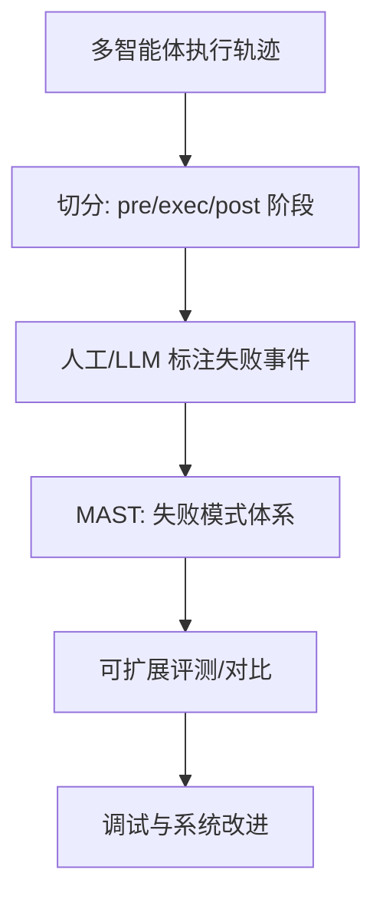
数据与实验：论文给出各框架在若干任务集上的成功/失败比例示意，并把失败模式映射到对话阶段（pre-execution / execution / post-execution）。citeturn56view0  
主要结果：除 Kappa=0.88 外，论文图示展示了多框架在不同任务集上的失败率分布，并指出部分 SOTA 开源框架在某些集合上正确率可低至约 25%（以论文图示说明为准）。citeturn56view0  
优点/局限：优点是把“失败分析”从零散案例升级为可复用 taxonomy 与数据集；局限在于标注成本高、任务集选择会影响结论外推，且 LLM-as-a-Judge 的偏差仍需持续校准。citeturn56view0  
复现要点：作者开源数据与标注器；复现应重点对齐任务集版本、轨迹采集策略与 judge 配置。citeturn56view0

**Evolving Orchestration（NeurIPS 2025）— “编排器即策略”：用 RL 演化多智能体推理图**citeturn46view0turn27view0  
问题：静态组织结构（固定链/树/网格）在 agent 数增加或任务复杂时会产生协调开销与冗余计算，导致效率与性能双降。citeturn27view0turn46view0  
贡献：提出 puppeteer 范式：中心化 orchestrator 动态决定每一步调用哪个“puppet agent”，并用强化学习在线优化“性能 + token/调用成本 + 早停”等目标，使协作结构在推理过程中演化为更紧凑的循环/子图。citeturn46view0turn47view1  
结构图：
```mermaid
flowchart TD
  S[任务状态/上下文] --> P[Orchestrator Policy]
  P --> Sel{选择/排序 Agent}
  Sel --> A[激活某个 Agent(推理/工具)]
  A --> S2[更新上下文/中间产物]
  S2 --> P
  P --> Term[终止 Agent] --> Out[输出]
  Out --> R[回报: 质量 - 成本] --> P
```
数据与实验：在闭域推理任务（如 GSM-Hard、MMLU-Pro 等）与开域场景评估，并报告“Initialized vs Evolved”阶段对比。citeturn46view0turn47view4  
主要结果：论文表格展示 Evolved 阶段显著优于 Initialized；例如在 Titan 子空间上，Puppeteer 的平均分从 **0.6671 提升到 0.7453**，并在若干任务上同时改善准确率与 token 消耗（以论文 Table 1/相关图为准）。citeturn47view0turn47view4  
优点/局限：优点是把“多智能体组织结构搜索”转为可学习策略，且可显式追踪成本；局限是回报设计较粗粒度（主要依赖最终输出与 token），并假设 agent/tool 集合固定。citeturn47view1turn46view0  
复现要点：代码开源于 ChatDev 的 puppeteer 分支；复现需对齐 agent 动作空间（工具/推理模式集合）、奖励权重与训练预算。citeturn46view0

**GUARDIAN（NeurIPS 2025）— 把“协作安全”做成时序图异常检测问题**citeturn52view0turn53view0  
问题：多智能体对话会出现“幻觉放大（hallucination amplification）”以及“错误注入与传播（error injection/propagation）”，单点的 self-check 或多数投票难以刻画传播动力学且对闭源模型不友好。citeturn52view0  
贡献：将多轮协作建模为离散时间的**时序属性图**（节点=某 agent 在某时刻的响应，边=通信），用无监督 encoder-decoder 重构属性与结构，以异常分数定位可疑节点/边；并用信息瓶颈思想做图抽象压缩，同时采用增量训练适配时序交互。citeturn52view0turn53view3  
结构图：
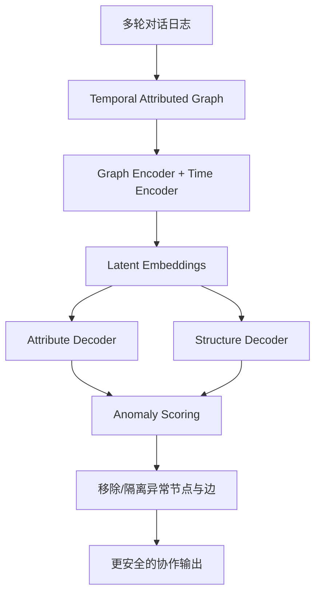
数据与实验：在 MMLU、MATH、FEVER 等任务上构造三类情境：幻觉放大、agent-targeted 攻击、communication-targeted 攻击，并在 GPT‑3.5‑turbo / GPT‑4o / Claude‑3.5-sonnet 等骨干上比较 LLM Debate、DyLAN、SelfCheckGPT 等基线。citeturn53view0turn52view0  
主要结果（示例）：在“幻觉放大”情境下（MATH，GPT‑3.5‑turbo），GUARDIAN 报告 **56.2%**（对比 DyLAN 40.8、LLM Debate 34.6、SelfCheckGPT 7.4）。citeturn53view0 论文还在“准确率 + API 调用量”维度展示效率优势：例如在 GPT‑3.5‑turbo、MMLU、4 agents 设置下，GUARDIAN 达到 **57.2%** 且 API≈**4.48**（对比 LLM Debate API=8、SelfCheckGPT API=16）。citeturn53view3  
优点/局限：优点是显式刻画传播结构并可视化；局限是图构建与异常定义依赖特定协议/通信格式，且对构造攻击/噪声的覆盖度会影响结论外推。citeturn52view0turn53view3  
复现要点：代码仓库公开；复现时要对齐攻击注入规则、图预处理（文本嵌入/通信抽象）与指标（accuracy、anomaly detection rate、FDR、API calls、runtime）。citeturn52view0turn53view3

**CogAgent（CVPR 2024）— 专为 GUI 设计的高分辨率 VLM 基座**citeturn40search0turn40search9turn35view0  
问题：通用 LLM 对 GUI 缺乏感知与定位能力；纯 HTML 输入又受平台限制与 token 冗长影响，难以覆盖移动/桌面异构界面。citeturn40search0turn40search9  
贡献：提出专用 GUI 视觉语言模型 CogAgent（论文页描述为 18B 参数），强调更高分辨率输入（例如 1120×1120）以识别细小 UI 元素与文本。citeturn40search0turn40search3  
结构图（抽象）：
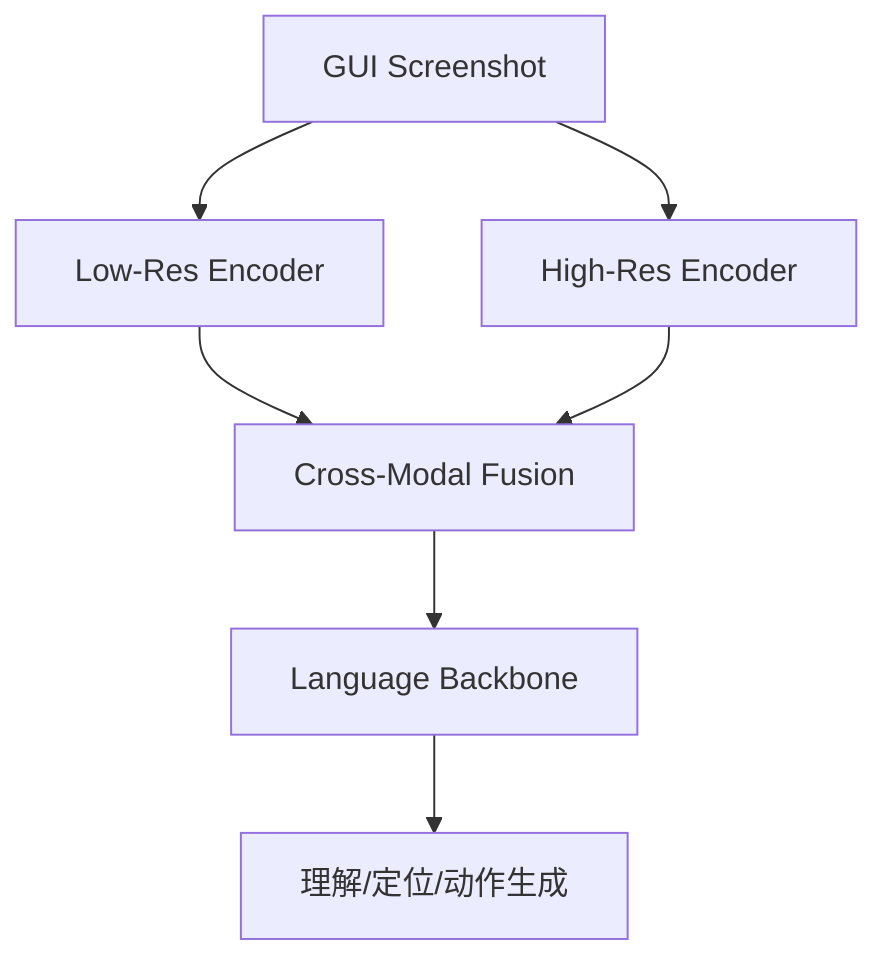
数据与实验：论文声称在多类“文本密集 VQA/文档理解”与通用 VQA 基准上达到 SOTA，并在 GUI 导航（Mind2Web、AITW）上以“仅截图输入”优于依赖抽取 HTML 的方法。citeturn40search3turn40search9  
主要结果：CVPR 虚拟会场页明确指出其在 Mind2Web 与 AITW 上优于消耗 HTML 的 LLM 方法，并提供模型/代码链接指向 CogVLM 仓库。citeturn40search9  
优点/局限：优点是把 GUI 能力做成“基础模型能力”而非外挂解析器；局限是通用 VLM 的训练成本高，且真实 GUI 操作仍需要动作空间定义与环境执行器（点击/输入等）的闭环。citeturn40search0turn40search9  
复现要点：优先核对发布的 checkpoint、训练数据与评测脚本；GUI 任务复现通常最容易在环境搭建（Android/web runner）处失败。citeturn40search9turn35view0

**Dual‑VCR（CVPR 2024）— “邻域而非整屏”：网页导航的关键上下文压缩策略**citeturn55view1turn55view0  
问题：真实网页的 HTML 规模巨大（上千元素/上万 token），直接喂给 LLM 成本高且上下文噪声大；但仅用截图/仅用 DOM 又容易丢失任务相关语义。citeturn54view0turn55view0  
贡献：提出 Dual‑View Contextualized Representation：对每个 HTML 元素，利用其在截图中的 bounding box 找到视觉邻居，把“邻居的 HTML text + 视觉特征（Pix2Struct ViT + ROI Align）”作为上下文增强，插入 MindAct 的 ranker 与 predictor 两阶段框架；并使用 Playwright 推断 bounding box。citeturn54view0turn55view1  
结构图：
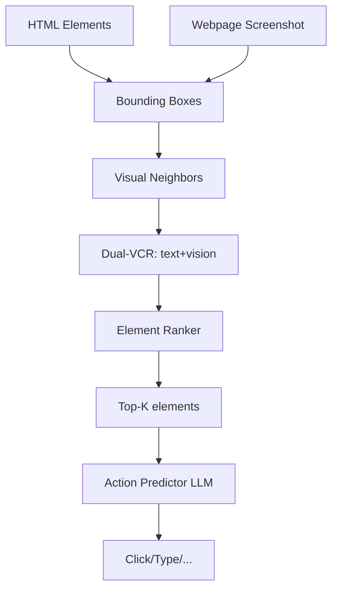
数据与实验：在 Mind2Web（137 网站、31 域、2K+任务）上，评估跨任务/跨站点/跨域三种泛化，并用元素召回（Recall@k）、元素准确率（Ele. Acc）、操作 F1（Op. F1）、步骤成功率（Step SR）等九项指标。citeturn54view0turn55view0turn55view1  
主要结果（示例）：在 Ranker 上，Recall@1 从 MindActRank 的 **25.4%** 提升到 Dual‑VCR（text+vis）的 **38.4%**；在 Cross‑Task 的 action 指标中，Ele. Acc/Op. F1/Step SR 可从 **42.0/74.9/41.1** 提升到 **47.0/78.7/46.0**（组合设置见表）。citeturn55view0turn55view1 此外，论文总结整体带来“九项指标平均 3.7% 绝对提升”。citeturn55view2  
优点/局限：优点是证明“结构化邻域上下文”比“整 HTML/整屏”更有效，且兼顾效率；局限是依赖网页可解析的渲染与元素对齐工具链，对动态页面与反爬限制的鲁棒性仍是工程难点。citeturn55view1turn54view0  
复现要点：需要稳定网页渲染环境、DOM/bbox 对齐工具与 Mind2Web 的评测切分；建议先复现 ranker 再复现 predictor。citeturn55view0turn25search3

**GUI‑Xplore / Xplore‑Agent（CVPR 2025）— 用“探索视频”补齐 App 泛化所需的结构知识**citeturn25search6turn25search10  
问题：移动 App 的 GUI 结构复杂、页面跳转逻辑多变，现有数据集/基准往往对“新 App 泛化”不足。citeturn25search6turn25search2  
贡献：提出 GUI‑Xplore 数据集：为每个 App 提供预录探索视频与层级化下游任务，并提出 Xplore‑Agent 结合 Action‑aware GUI Modeling 与 Graph‑Guided Environment Reasoning。citeturn25search6turn25search7  
结构图：
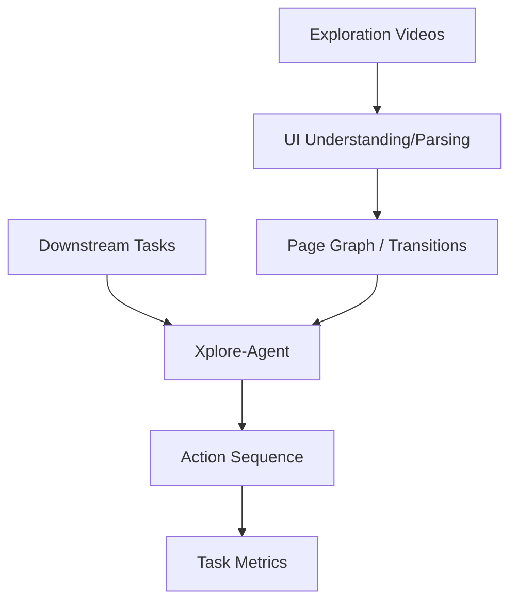
数据与实验：补充材料指出 GUI‑Xplore 覆盖 **312 个 App、6 大类、33 子类**，并支持 5 类下游任务（如 Application Overview、Page Analysis、Action Recall、Action Sequence 等）。citeturn25search10turn25search6  
主要结果：论文页总结其能更好利用探索视频带来的结构信息以提升泛化（具体指标与对比见 CVPR OpenAccess 正文/表格）。citeturn25search6turn25search2  
优点/局限：优点是把“探索”显式数据化，缓解冷启动与泛化瓶颈；局限是探索视频采集成本与隐私合规问题，且对“开放世界 App 更新”仍需持续增量维护。citeturn25search6turn25search10  
复现要点：复现需要拿到探索视频、任务定义与评测脚本，并对齐图构建细节（节点/边语义、检索与推理模块）。citeturn25search6turn25search10

**SpiritSight Agent（CVPR 2025）— 端到端视觉 GUI Agent 的 grounding 强化路径**citeturn40search13turn25search15  
问题：纯视觉 GUI agent 兼容性好，但“元素 grounding 不准”会导致执行失败，尤其在高分辨率/动态布局下。citeturn40search13turn25search5  
贡献：提出 SpiritSight：构建大规模多层级 GUI 数据集 GUI‑Lasagne，并提出 Universal Block Parsing（UBP）缓解动态高分辨率策略带来的歧义，提升 GUI 对象定位与可执行性。citeturn40search13turn25search5  
结构图：
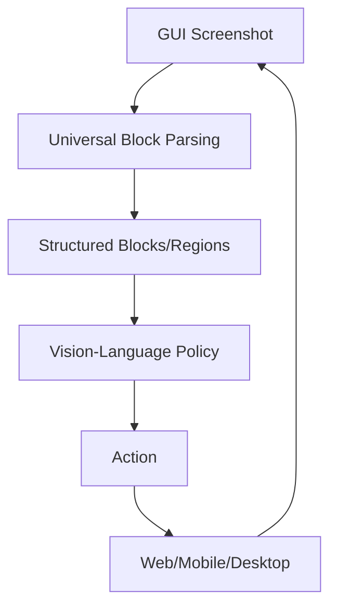
数据与实验：补充材料列出其评测覆盖多个平台/任务基准：Multimodal‑Mind2Web、ScreenSpot、GUIAct、AMEX、AndroidControl、GUI Odyssey。citeturn25search15turn40search13  
主要结果：论文摘要/会场页表述其在多种 GUI 基准上优于其他先进方法，强调“兼容性 + 准确率”同时改善（具体数值见 CVPR 论文表格）。citeturn25search5turn40search13  
优点/局限：优点是把 grounding 作为核心瓶颈，给出数据与解析两手方案；局限是端到端方法对数据覆盖与标注质量高度敏感，跨设备/主题/语言泛化仍需更严格评测。citeturn40search13turn25search15  
复现要点：优先跟踪论文项目页发布的模型与数据；GUI 数据集常受许可限制，需确认可用性与替代基准。citeturn40search13

## 跨论文综合：方法谱系、评测与难题

从 2024–2025 的顶会论文可以抽象出一套“Multi-Agent × GUI Agent”的方法谱系（taxonomy），并能看出若干在不同任务里反复出现的共性技术模块。citeturn56view0turn46view0turn55view1turn25search6turn40search13

方法谱系（简化）：
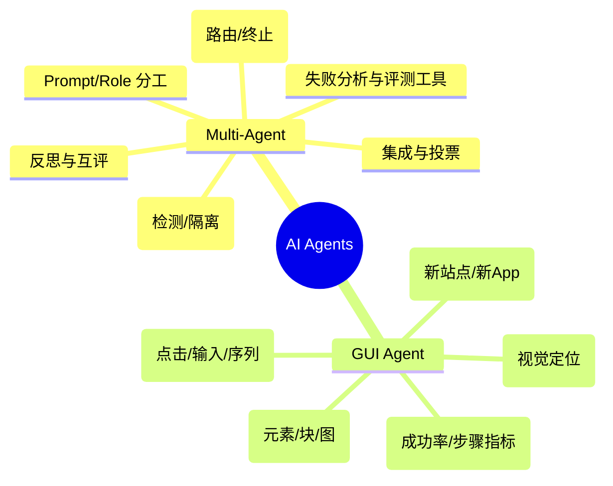

在 Multi-Agent 方向，“协作机制”大体经历了三阶段演进：  
第一阶段是 **静态角色/固定协议**（典型如软件工程分工流程、辩论/自检等），优点是工程简单但扩展性差；第二阶段是 **把协作中的关键环节（反思、集成）做成可优化对象**，例如 COPPER 的共享反思器与反事实归因、Mixture-of-Agents 的分层集成；第三阶段是 **把系统级编排做成策略学习问题**，例如 puppeteer 用 RL 学习动态调用与剪枝，同时 GUARDIAN 把协作安全转成图异常检测。citeturn43search1turn36search7turn46view0turn52view0turn56view0

GUI Agent 方向则呈现“数据与表征双轮驱动”：  
一方面，CogAgent 类工作把 GUI 能力内生为 VLM 的基础能力（高分辨率理解 + 文本/控件识别）；另一方面，Dual‑VCR 证明只要找到“对决策最有用的局部结构上下文”，就能在成本可控下显著提升动作预测；而 GUI‑Xplore 与 SpiritSight 则把“可泛化数据（探索视频/大规模 GUI 数据）+ 结构化解析（图推理/块解析）”推进到移动端、跨平台基准。citeturn40search0turn55view1turn25search10turn40search13

评测基准与指标正在趋于统一，但仍存在“可比性不足”：  
对多智能体系统，除了传统准确率/成功率，越来越多论文同时报告 **成本指标**（token、API calls、时间）与 **鲁棒性指标**（攻击/错误注入下的准确率、异常检测率、FDR），GUARDIAN 就将 accuracy 与 API calls 并列为核心对比轴。citeturn53view3turn52view0 对软件工程代理，SWE-bench 作为 ICLR 2024 Oral 的代表性基准为 “issue 修复”给出较明确的测试闭环定义，MAGIS 等工作在此基础上探索多智能体流程与定位能力。citeturn39search5turn42view0 对 GUI 代理，Mind2Web 仍是网页导航的核心基准之一，而 Dual‑VCR 给出了“ranker + predictor”可分解的诊断方式，有助于定位性能瓶颈。citeturn25search3turn55view1

开放挑战可以归纳为五类：  
第一类是 **可靠性与失效诊断**：MAST 表明失败模式很“长尾”，且往往需要系统级解决方案（而非单点 prompt 修补）。citeturn56view0 第二类是 **规模化与效率**：多 agent 带来组合爆炸，必须引入路由/剪枝/早停与成本约束学习（puppeteer、GUARDIAN 的 API calls 视角）。citeturn47view1turn53view3 第三类是 **安全与对抗**：协作过程引入传播效应，促使以图/时序结构建模异常成为新范式。citeturn52view0turn53view0 第四类是 **GUI 泛化与数据鸿沟**：新 App/新站点的跳转逻辑、UI 组件多样性使“探索数据 + 结构推理”成为关键。citeturn25search10turn25search6 第五类是 **评测协议与可比性**：不同工作在环境、提示、评审器与成本统计口径上差异很大，导致“只有 SOTA 结论、缺少可迁移结论”的情况依旧普遍。citeturn56view0turn55view1turn8view0

本报告给出的“可操作研究方向”建议：  
其一，围绕 MAST/GUI‑Xplore 这类“结构化评测”体系，发展 **可解释、可诊断的 agent 训练与调参流程**；其二，将 puppeteer 类“协作路由”与 MoA 类“模型集成”结合，形成对 **性能—成本—安全**的三目标优化；其三，在 GUI 端把 Dual‑VCR 的“局部上下文压缩”与 SpiritSight 的“块级解析”统一为可迁移的 UI 表征学习目标，以减少对端到端大模型的纯数据依赖。citeturn56view0turn46view0turn36search7turn55view1turn40search13

## 两年趋势时间线与未来方向

下面用时间线概括 2024–2025 在 Multi-Agent 与 GUI Agent 的关键里程碑（以代表性论文为锚点）。citeturn43search1turn39search13turn36search6turn36search15turn56view0turn27view0turn52view0turn40search0turn55view2turn25search6turn40search13

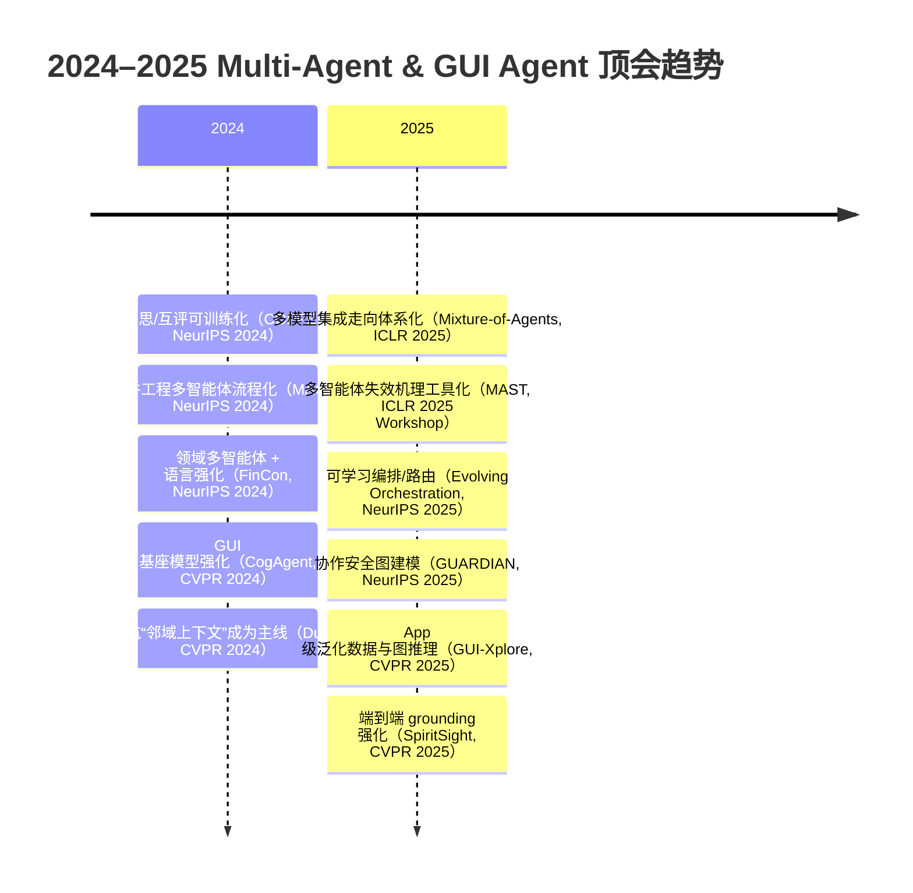

在“必读清单”层面，建议优先通读以下 12 篇（与上文深度解读对应），理由分别对应“范式性贡献/可复现基准/高引用影响/可迁移模块”：COPPER（反思可训练化）、MAGIS（SWE‑bench 上的流程化多 agent 修复）、FinCon（领域经验沉淀机制）、Mixture-of-Agents（分层集成范式）、Hypothetical Minds（ToM 假设—验证机制）、MAST（失败模式体系化与可扩展评测）、Evolving Orchestration（RL 编排器范式）、GUARDIAN（协作安全图建模）、CogAgent（GUI VLM 基座）、Dual‑VCR（邻域上下文压缩与两阶段诊断）、GUI‑Xplore（探索视频与 App 泛化）、SpiritSight（交互式 grounding 强化）。citeturn44search8turn42view0turn36search6turn36search7turn51view0turn56view0turn47view1turn53view3turn40search0turn55view1turn25search10turn40search13